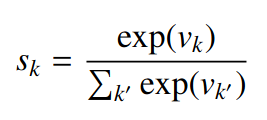
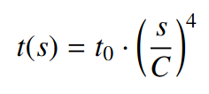
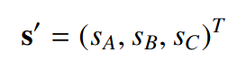
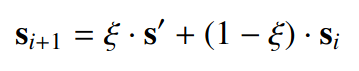
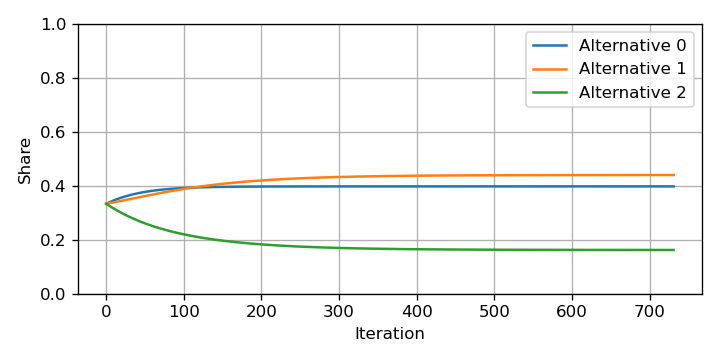
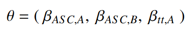
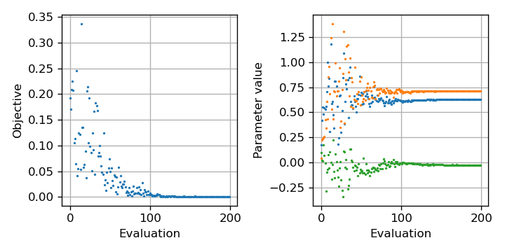

# Introductory example

This document describes a basic calibration process using the framework. For
that purpose, we define a simple model, which poses as an example for any
simulator that you might want to wrap up for the framework.

## The model

The model can be found in [model.py](model.py) and is described by the
`ModeShareModel` class. It represents a multinomial logit (MNL) model of the
following structure:



It has four different modes (A, B, C) with the following utility functions:


The model has four main parameters: the alternative-specific constants for
the three alternatives, and the marginal utility of travel time for the
first alternative. Furthermore, the travel time is dependent on the share of
the first alternative. To introduce some non-linear dynamics to the model, we
make this travel time dependent on the shares of the first alternative. This
models a mode with limited capacity (for instance car traffic that is limited
by the infrastructure or a public transport network with limited throughput). The
travel time is defined as:



Two parameters are included in the travel time model: the capacity of the system
and the "free flow" travel time. With increasing mode share, travel time increases
and the mode becomes less attractive.

The model performs a simulation starting at an initial mode share vector of `[0.33, 0.33, 0.33]`
if not specified otherwise. The simulation then calculates the travel time given the first mode shares, and then calculates updated mode shares for all modes according to the MNL as



Updating the state directly this way, the procedure would
lead to heavy oscillatory behavior for many parameter combinations. Hence, we use averaging to update the state:



The blending factor *ξ* defines how strongly the previous state will be updated
towards the theoretic new equilibrium. However, when performing the calculation
iteratively, the state slowly approaches the final equilibrium.

The output of the simulator is the state over all simulated iterations (e.g. if
1000 iterations were simulated, one will have three time series for the three
alternatives of 1000 values). The number of iterations can either be fixed, or
(be default) the simulation is stopped if all three alternatives do not vary for
more than a fixed threshold *T* from the previous state.

The notebook [Model.ipynb](Model.ipynb) can be used to play around wit the
model parameters and see the output.

The following figure shows an example of the output:



## Calibration problem

To test the calibration procedure, we need to obtain reference values. For that,
we choose the following configuration of parameters:

This combination of parameters approximately leads to the reference shares that
we want to reconstruct during the calibration: `[0.4 , 0.44, 0.16]`.

In the calibration, we keep most parameters fixed and treat the following parameters as unknown:



The goal of the calibration is to find values that reproduce the reference shares.

## Wrapping the simulator

Other than some simulators that have preexisting wrappers in the framework (see
the examples), our simple model is really only a basic computational model for
now that still needs to be wrapped to be used in the calibration framework.

Have a look at [wrapper.py](wrapper.py) for a full explanation. The main point
is to implement the *Evaluator* interface, while here, we extend the *BaseEvaluator*
class which already takes care of managing (potential) parallel simulations. We
need to implement four methods:

- `start_evaluation(self, identifier, values, information)`: Here, we start a
new simulation run with a predefined identifier provided by the system. The
`values` vector contains the proposed parameter values that should be implemented
in the simulation and `information` contains additional information from the
optimizer, which we do not use here. In our case, we directly perform the simulation
inside `start_evaluation` while in a more general setting we could start a new
process locally or even on a remote server.
- `check_evaluation(self, identifier)`: In our case it returns always `True`, in
the general case we would indicate whether a simulation has finished or not.
- `get_evaluation(self, identifier)`: The systems expects to receive a `Evaluation`
object that contains all necessary information on the simulation, plus an objective
value.
- `clean_evaluation(self, identifier)`: This is where we clean up any temprarily
saved information on the simulation with the unique `identifier`.

The most interesting part are `start_evaluation` where we run the model and
`get_evaluation` where we calculate the objective. In the former, the model
is initialized as

```python
model = ModeShareModel(
    constants = [values[0], values[1], -0.3],
    beta = values[2], capacity = 0.5, travel_time = 1.0,
    blending = 1e-2
)
```

One can see that the `values` vector provided by the optimizer is used to
populate the model parameters. The first two entries of the vector are used
as the first two alternative-specific constants, while the third one is fixed
to `-0.3`. The third element of `values` is used to fill out the value for the
marginal utility of travel time.

In `get_evaluation` we first calculate the difference of the simulation outcome
with the respective reference values:

```python
reference = np.array([0.4 , 0.44, 0.16])
state = self.results[identifier][-1]
delta = reference - state
```

and then we calculate a *L1* norm of the difference vector to arrive at a single
objective value:

```python
objective = np.sum(np.abs(delta))
```

A perfect fit of the values would mean a zero objective value, while any mismatch yields a positive
value that needs to be minimized.

## Performing the calibration

The calibration procedure itself is covered in the [Calibration.ipynb](Calibration.ipynb)
notebook. It describes cell by cell how the optimization loop is defined.

First, an instance of the evaluator needs to be created. It will be used by the
optimization algorithm to request new evaluations of the model parameters:

```python
evaluator = ModeShareEvaluator()
```

Next, a problem instance needs to be defined. A `Problem` defines general
information such as the number of parameters, their bounds, and initial values.
Not all of this information is needed by all algorithms, but some will complain
if they are not available. Here, we stick to a very generic `ContinuousProblem`:

```python
problem = ContinuousProblem(
    3, [(-5, 5), (-5, 5), (-5, 5)], [0.0, 0.0, 0.0]
)
```

It says that we operate on three parameters (because one of the alternative-specific
constants is kept at a fixed value) and we define that the values should reside in
the interval `(-5, 5)`. Different algorithms will treat bounds differently or simply
ignore them if they are not designed for constrained optimization. In our test case,
we initialize the values at `(0.0, 0.0, 0.0)`.

Next, the notebook defines the algorithm to use:

```python
algorithm = CMAES1P1Algorithm(problem)
```

Here, we use the CMA-(1,1)-ES algorithm by [Igel et al. (2006)](http://portal.acm.org/citation.cfm?doid=1143997.1144082). After, we create a calibration
loop that puts all ingredients together:

```python
loop = Loop(
    algorithm = algorithm,
    evaluator = evaluator,
    maximum_evaluations = 200,
)
```

We pass the selected algorithm and evaluator and define that the loop should
allow a maximum of 200 evaluations until it is stopped. The loop will continuous
tell the algorithm to advance the search and track how many evaluations are
requested in this process.

To start the loop, we have to call `loop.advance()`. However, to obtain any
information on the progress, we need to define a `Tracker` object that is passed
to the loop. In the notebook, we define the following tracker:

```python
objectives = []
values = []

def my_tracker(state, evaluations):
    for evaluation in evaluations:
        values.append(evaluation.get_values())
        objectives.append(evaluation.get_objective())

    if len(values) % 20 == 0:
        print("Finished evaluations: ", len(values))
```

This tracker is called whenever there is an update in the calibration loop. The
`state` variable contains information on the state of the evaluator (if it is
more sophisticated than our ad-hoc version) and the algorithm. The `evaluations`
variable contains a list of all evaluations that have finished since the last
call to `my_tracker`, i.e. during one full run of an iteration of the optimization
algorithm. Here, we simply track the tested parameter `values` and the resulting
`objectives` in two lists.

In the notebook, we produce a plot of these outputs as shown in the next Figure.



We can see how, initially, the algorithm tries strongly varying parameter values
to get an idea of the location of the optimal value. After, it exploits more
aggressively the existing information to find a minimal objective value.
